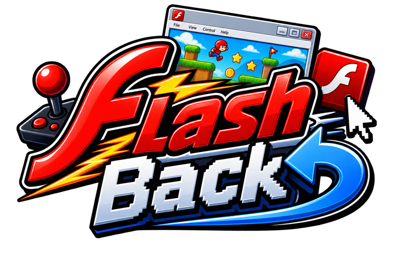
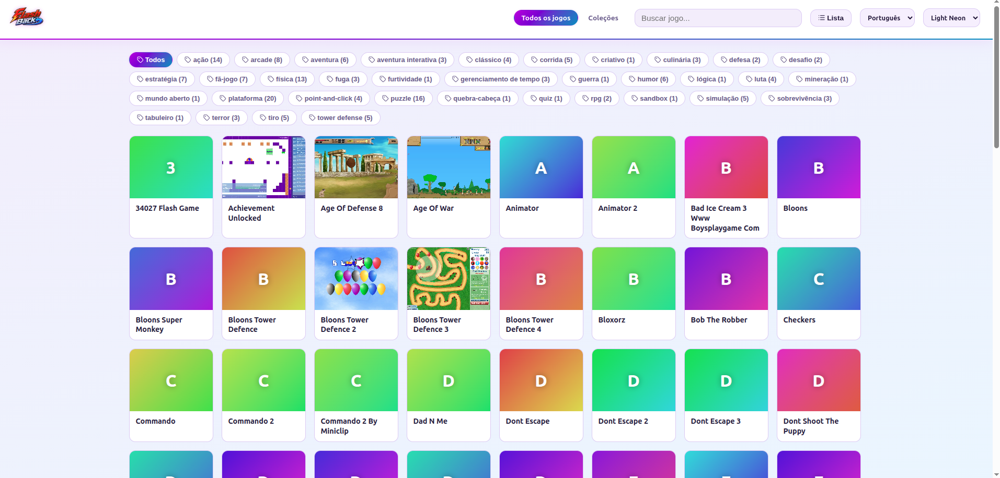
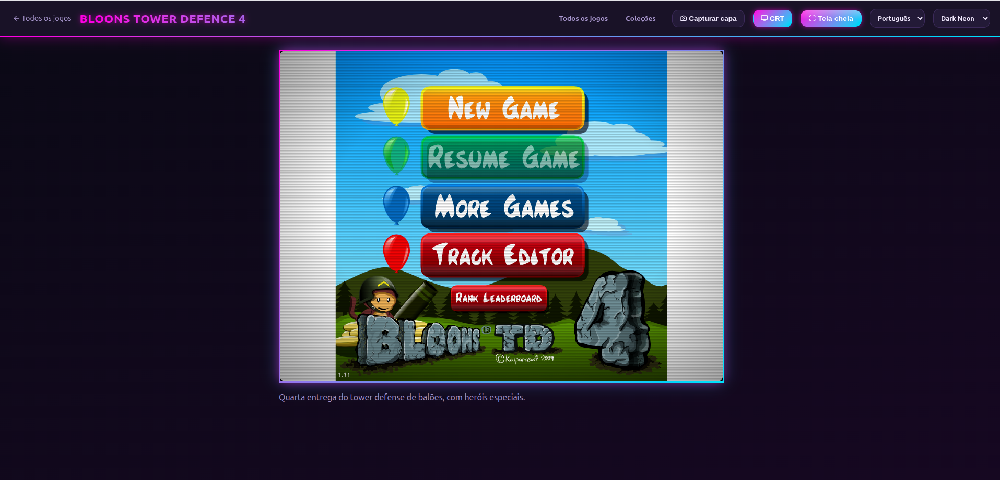
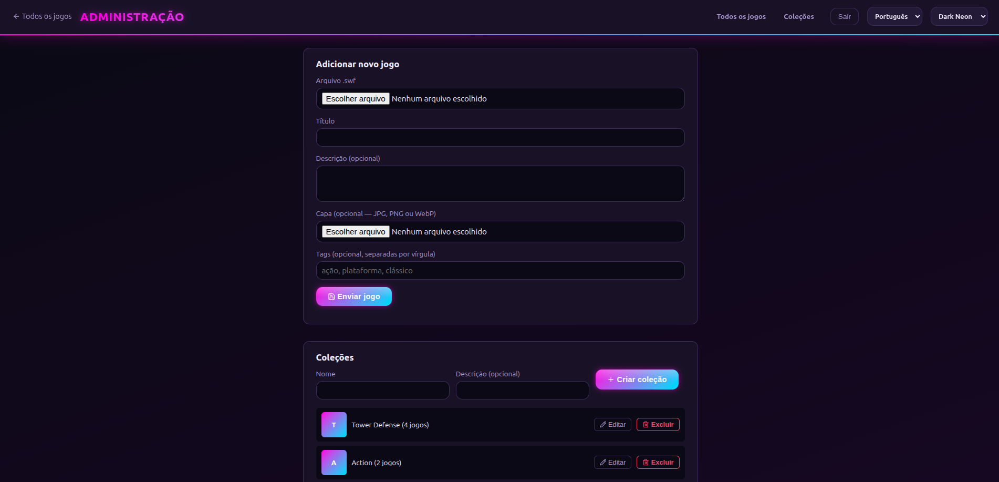

<p align="center">
  
</p>

# FlashBack

[](https://hub.docker.com/r/junkatana/flashback)
[](https://hub.docker.com/r/junkatana/flashback)
[](LICENSE)

Self-hosted library of classic Flash games, played directly in the browser via [Ruffle](https://ruffle.rs), no plugins, no Flash Player install. Think of it as a "RomM for Flash games": browse a library, organize it into collections and tags, and play everything from a normal web browser.

The library starts out empty. Add games yourself, either by uploading your own `.swf` files or by importing them from [Flashpoint Archive](https://flashpointarchive.org) right from the admin panel (see [Importing from Flashpoint Archive](#importing-from-flashpoint-archive) below).

## Links

| | |
| --- | --- |
| Source code | [github.com/arthur-alves/flash-back](https://github.com/arthur-alves/flash-back) |
| Docker image | [hub.docker.com/r/junkatana/flashback](https://hub.docker.com/r/junkatana/flashback) |
| Report an issue | [github.com/arthur-alves/flash-back/issues](https://github.com/arthur-alves/flash-back/issues) |
| License | [MIT](LICENSE) |
| Flashpoint Archive (game source) | [flashpointarchive.org](https://flashpointarchive.org) |
| Ruffle (Flash emulator) | [ruffle.rs](https://ruffle.rs) |
| Lucide (icons) | [lucide.dev](https://lucide.dev) |

## Features

- **Browsable library** with live search, tag filters, and grid/list view toggle
- **Collections**: curated groups of games, each with its own page; a game can belong to more than one
- **In-browser Flash emulation** via a self-hosted Ruffle build, no CDN dependency, no plugin install
- **Fullscreen mode** and an optional **CRT scanline overlay**, handy for the many games shipped at very low native resolutions
- **Pixel-art upscale filters** (2xSaI, HQ2X, xBR) via a small WebGL shader pipeline, one active at a time
- **Swappable themes** via plain CSS files (see [THEMES.md](THEMES.md)), ships with Dark Neon, Light Neon, Geo (Y2K) and NES (8-bit)
- **Multi-language UI** (English default, Portuguese included) via a small dictionary-based i18n system (see [LANGUAGES.md](LANGUAGES.md))
- **Admin panel** to upload your own `.swf` games and cover art, protected by a real login (not the browser's native Basic Auth popup)
- **Import from Flashpoint Archive**: search [flashpointarchive.org](https://flashpointarchive.org) by name and import a Flash game straight from one of its original hosting links, if one is still alive (see [Managing games](#managing-games-admin) below)
- Uploads are validated by **file content**, not extension: a renamed `.txt` won't pass as a `.swf`
- **Simple JSON storage**: no database, easy to inspect/edit/back up by hand
- Icons via inlined [Lucide](https://lucide.dev) SVGs (self-hosted, ISC license)

## Screenshots

| Library | Player | Admin |
| --- | --- | --- |
|  |  |  |

## Requirements

- Node.js 18+
- `unzip` available on `PATH` (used by the Ruffle fetch script)
- Docker + Docker Compose (only if you want to run it containerized)

## Quick start (Node, no Docker)

```bash
npm install

# Downloads the Ruffle web player (self-hosted, no CDN dependency)
npm run fetch-ruffle

npm start
```

Open **http://localhost:4000**. The library starts empty; see [First-time setup](#first-time-setup) to create your admin account, then [Managing games](#managing-games-admin) to add your first titles.

## Quick start (Docker)

Using the published image (no build step, works anywhere Docker runs, including Portainer):

```bash
docker compose up -d
```

`docker-compose.yml` pulls [`junkatana/flashback`](https://hub.docker.com/r/junkatana/flashback) (multi-arch: `amd64`/`arm64`) and mounts `./volumes/{games,data,ruffle}` as persistent volumes. On first container start, the entrypoint automatically fetches Ruffle into that volume and starts with an empty game library; this only happens once, later restarts reuse what's already there.

Open **http://localhost:4000** (or whatever port you mapped).

If you'd rather build from source instead of pulling the published image, use `docker-compose.dev.yml`:

```bash
docker compose -f docker-compose.dev.yml up -d --build
```

### Installing via Portainer

1. **Stacks → Add stack**
2. Name it (e.g. `flashback`), and either:
   - **Web editor**: paste the contents of [`docker-compose.yml`](docker-compose.yml), or
   - **Repository**: point at this Git repo, with `docker-compose.yml` as the compose path. Portainer will pull updates from GitHub whenever you redeploy the stack
3. **Deploy the stack**
4. Once it's running, open the container's mapped port in your browser and follow [First-time setup](#first-time-setup) below

Password resets (`RESET_ADMIN`) work the same way as any other environment variable change: **Containers → flashback → Duplicate/Edit → Env**, or edit the stack and redeploy. See [Forgot your password?](#forgot-your-password) below.

### Updating to a new image version

The `docker-compose.yml` pulls `junkatana/flashback:latest`, so getting a new release doesn't require editing anything, just pulling the image again and recreating the container:

- **Portainer**: open the `flashback` stack and click **Pull and redeploy** (or, on older Portainer versions, **Stacks → flashback → Editor → Update the stack**, checking "Re-pull image"). Portainer re-downloads `:latest` and recreates just the container, your `games`/`data`/`ruffle` volumes are untouched.
- **Plain Docker Compose**:
  ```bash
  docker compose pull flashback
  docker compose up -d flashback
  ```

Either way, this only replaces the application code, it does not reset your library, admin account, or covers, since those all live on the mounted volumes rather than inside the image.

## First-time setup

The admin panel doesn't ship with a default password. On a fresh install, before any account exists, **every** page (the library, the API, everything) redirects straight to **`/setup`** until you create one, so you can't end up browsing a freshly installed instance no one has actually configured yet:

1. Open the app at **http://localhost:4000** (any URL works, you'll land on `/setup`)
2. Choose a username and a password (8+ characters)
3. You're logged in immediately and land on the admin panel
4. From this point on, `/setup` stops being reachable and the site behaves normally for everyone

From then on, `/admin` requires logging in at **`/login`**. Sessions are stored as an HttpOnly cookie and last 30 days, but they live in server memory, so restarting the server/container logs everyone out (you'll just need to log in again, the account itself isn't affected).

### Forgot your password?

There's no email/SMS recovery. This is meant to run reset via an environment variable, which works whether you manage the server from a terminal or entirely through Portainer's web UI:

1. Set the environment variable `RESET_ADMIN=true` on the container (in Portainer: **Containers → flashback → Duplicate/Edit → Env** tab, or edit the stack's `docker-compose.yml` and redeploy)
2. Restart the container
3. Visit `/admin` again, you'll land back on the setup wizard to create a fresh account
4. **Set `RESET_ADMIN` back to `false` (or remove it) and restart again**, otherwise every restart wipes the account you just created

If you're running it directly with Node instead of Docker, the equivalent is:

```bash
RESET_ADMIN=true npm start
# stop it (Ctrl+C) once you see the "admin account cleared" message, then:
npm start
```

### Authentication & password storage

There's no database and no third-party auth library. The whole account system is one JSON file, `data/admin.json`, created the moment you finish `/setup`:

```json
{
  "username": "your-username",
  "salt": "a1b2c3...",
  "passwordHash": "9f8e7d..."
}
```

- **Username** is stored as plain text; it's an identifier, not a secret.
- **Password is never stored.** At signup, a random 16-byte `salt` is generated and the password is run through `crypto.scryptSync(password, salt, 64)`. Only the resulting hash is kept; the plaintext password never touches disk.
- **scrypt**, not MD5/SHA/bcrypt, because it's deliberately memory-hard: expensive to run at scale, which makes brute-forcing a stolen `admin.json` far more costly than a fast hash would. It's also built into Node's `crypto` module, so it adds zero dependencies.
- **Login** recomputes the hash from the submitted password using the stored `salt`, then compares it with `crypto.timingSafeEqual` instead of `===`, so a network attacker can't infer the correct hash byte-by-byte from response-time differences. Usernames are compared the same way.
- **Sessions** aren't JWTs or anything self-contained. Logging in generates a random 32-byte token, stored in an in-memory `Map` (`token → createdAt`) on the server process, and sent to the browser as an `HttpOnly; SameSite=Lax` cookie valid for 30 days. Keeping sessions in memory (not a file or database) means a server/container restart logs everyone out, but the account itself is untouched: a deliberate trade-off for a single-admin self-hosted tool, where "everyone re-logs in after a restart" is a minor inconvenience and "one less place secrets can leak from" is worth it.

`data/admin.json` is gitignored and lives on a mounted volume in Docker, so it never ends up in the repository or in the published image.

**Security scope.** FlashBack is built for running on a home/local network: a single admin, on their own LAN, behind their own router/firewall. Under that assumption, the above is enough, the only people who can reach `/login` are already inside the trusted network. What's deliberately **not** implemented, because it isn't needed for that scenario, includes:

- Login rate limiting / account lockout: nothing stops unlimited password attempts against `/api/login`
- The session cookie doesn't set `Secure`, so it isn't forced over HTTPS
- 2FA, audit logging, multi-user roles

If you plan to expose FlashBack beyond your local network (a public URL, port-forwarding, DDNS, etc.), treat these as real gaps, not theoretical ones. Put it behind a reverse proxy with HTTPS (Caddy, Traefik, Nginx) at minimum, and consider adding rate limiting before doing so. These are straightforward to add later; they were left out of the initial scope on purpose, not overlooked, to keep the project simple for its intended use case. Contributions welcome if you want to add them.

## Using the library

- **Search**: the box in the top bar filters by title as you type
- **Tags**: click a tag chip to filter the library down to that tag; click "All" to clear it
- **Collections** (`/collections`): curated groups; click one to see just its games
- **Grid/List toggle**: top-right button; list view also shows each game's description
- **Theme toggle**: sun/moon icon, switches light/dark, remembered in your browser
- **Playing a game**: click any card, then:
  - **Fullscreen** button (uses the browser's native Fullscreen API)
  - **CRT** button overlays scanlines + a vignette, purely cosmetic CSS, doesn't touch how Ruffle renders the game, but helps a lot with games that shipped at tiny native resolutions
  - **Pixel filter** dropdown (Original / 2xSaI / HQ2X / xBR): runs the live frame through a WebGL shader for smoother pixel-art scaling; "Original" disables the shader pipeline entirely, so there's no cost unless you pick one

## Managing games (admin)

The easiest way is the admin panel (`/admin`):

1. **Add new game**: pick a `.swf` file, a title, optional description/cover/tags, then submit
2. In the **Registered games** table you can, per game:
   - Click the cover thumbnail to upload/replace it
   - Edit tags directly in the text field (comma-separated)
   - Toggle collection membership via the chip buttons
   - Remove the game entirely (deletes the file + its cover from disk too)

### Importing from Flashpoint Archive

<p>
  
  <a href="https://flashpointarchive.org"><b>Flashpoint Archive</b></a> is one of the largest web-game preservation efforts that exists: a free, non-profit, community-run project keeping well over 100,000 Flash, Shockwave, HTML5 and other legacy web games and animations playable long after the platforms they depended on disappeared. Without work like theirs, most of this era of web games would already be unrecoverable. FlashBack's admin panel can search their archive directly and, with real respect for the scale of what they've built, borrow only what it needs: a working link back to a game's original home.
</p>

The **Import from Flashpoint Archive** search box in `/admin` lets you type a game name; it searches [flashpointarchive.org](https://flashpointarchive.org/search) for matches. For each result, it reads the entry's original "Launch Command" links (the URLs the game used to be hosted at, e.g. `miniclip.com`, `addictinggames.com`) straight off Flashpoint's own [game pages](https://flashpointarchive.org/view?id=bda1e0d7-145f-4c64-b354-bafbc68ccb75), and imports the game only if one of them still serves a real `.swf` file, validated with the same content check used for manual uploads.

A few things worth knowing:

- Only entries tagged `Platform: Flash` on Flashpoint are importable; other platforms they preserve (HTML5, Shockwave, Unity, etc.) are outside this project's scope and are rejected.
- It deliberately does **not** use Flashpoint's own GameZIP mirrors ([datahub docs](https://flashpointarchive.org/datahub/QEMU_GameZIP_Server)), which would mean depending on an unofficial third-party site to resolve a working download URL. If none of a game's original links are still online, the import is skipped rather than falling back to that, out of respect for infrastructure that isn't ours and wasn't built for this kind of external, automated use.
- Requests are always sequential (never parallel), sent with a real, identifying User-Agent, and throttled by a short server-side cooldown between searches/imports, so this can't be used to hammer flashpointarchive.org or the original third-party hosts it links to. It's a manual, one-game-at-a-time tool, not a bulk scraper.
- If you have games to contribute back, or just want to support the people doing this preservation work, see Flashpoint's [downloads page](https://flashpointarchive.org/downloads/) and [contributing guide](https://flashpointarchive.org/datahub/Extended_FAQ).

You can also do it by hand: drop a `.swf` file into `games/`, then add an entry to `data/catalog.json`:

```json
{
  "slug": "my-game",
  "title": "My Game",
  "description": "Optional description.",
  "file": "my-game.swf",
  "sizeBytes": 123456,
  "cover": null,
  "tags": ["puzzle", "arcade"]
}
```

To add a cover image by hand, place a file at `data/covers/<slug>.<ext>` (`jpg`, `png` or `webp`) and set `"cover": "<ext>"` in the catalog entry. The filename must match the game's `slug` exactly; nothing else identifies which cover belongs to which game. `coverVersion` is optional (used only for browser cache-busting); leave it out or `0` and it'll still work.

### Bulk-importing a ready-made library

If you already have a folder full of games with covers (e.g. from another emulator front-end), you can script this instead of using the admin panel one by one:

1. Copy every `.swf` into `games/`.
2. Copy every cover into `data/covers/`, renamed to `<slug>.<ext>`. The slug must match the corresponding catalog entry's `slug`, not the original filename.
3. Generate `data/catalog.json` as an array of entries like the one above, one per game.

Slugs are lowercase, hyphenated versions of the title (see `server/lib/slugify.js` for the exact rule) and must be unique. If two games would slugify to the same string, the admin panel appends `-2`, `-3`, etc., but a hand-built catalog needs to do this itself.

## Managing collections (admin)

In the **Collections** section of the admin panel:

1. Create a collection with a name and optional description
2. Click its thumbnail to give it cover art (falls back to a color+initial card like games do, if you skip this)
3. Scroll down to the games table: click a collection's chip on any game's row to add/remove it from that collection (a game can be in as many collections as you want)
4. Edit or delete a collection from the list: deleting a collection never deletes the games in it

Collections show up as cards on `/collections` and get their own page at `/collection?slug=...`.

## Environment variables

| Variable | Default | Purpose |
| --- | --- | --- |
| `PORT` | `4000` | Port the server listens on |
| `MAX_UPLOAD_MB` | `200` | Max size (MB) for `.swf`/cover uploads in the admin panel |
| `RESET_ADMIN` | unset | Set to `true` to wipe the admin account on next startup and re-trigger the setup wizard |

## Project structure

```
server/
  index.js              Express app (public + admin API, static file serving)
  lib/
    validateSwf.js       Checks the FWS/CWS/ZWS magic bytes of uploaded .swf files
    validateImage.js     Checks JPEG/PNG/WebP magic bytes of uploaded covers
    auth.js               Account setup, scrypt password hashing, cookie
                           sessions, and the RESET_ADMIN escape hatch
    flashpoint.js         Search + import from Flashpoint Archive
    slugify.js
  scripts/
    fetch-ruffle.js       Downloads the self-hosted Ruffle build
data/
  catalog.json           Game metadata (starts empty, gitignored)
  collections.json       Curated collections (starts empty, gitignored)
  admin.json             Admin username + salted password hash (gitignored)
  covers/                 Cover images: games and data/covers/collections/ (gitignored)
games/                    Your uploaded/imported .swf files (gitignored)
public/
  index.html              Full game library + tag filters
  collections.html        All collections
  collection.html          One collection's games
  play.html                Ruffle player (fullscreen, CRT toggle)
  setup.html / login.html  Admin auth
  admin.html               Admin panel (games, covers, tags, collections)
  js/                       One script per page, plus shared icons.js/theme.js/
                             i18n.js/viewToggle.js
  css/style.css             Structure only, colors/fonts/radius come from
                             css/themes/*.css (see THEMES.md)
  css/themes/                One CSS file per theme
  fonts/                      Self-hosted fonts used by specific themes
```

## Documentation

- [THEMES.md](THEMES.md): how the theme system works and how to create a new one
- [LANGUAGES.md](LANGUAGES.md): how the i18n system works and how to add a new language

## Legal note

This project does not ship or redistribute any Flash game files itself, and the library starts empty. Any games in your instance were either uploaded by you directly or imported from [Flashpoint Archive](https://flashpointarchive.org) via its own original hosting links. All game rights remain with their original creators. If you are a rights holder and have a concern about a game imported through this tool, please open an issue.

## License

MIT, see [LICENSE](LICENSE).
